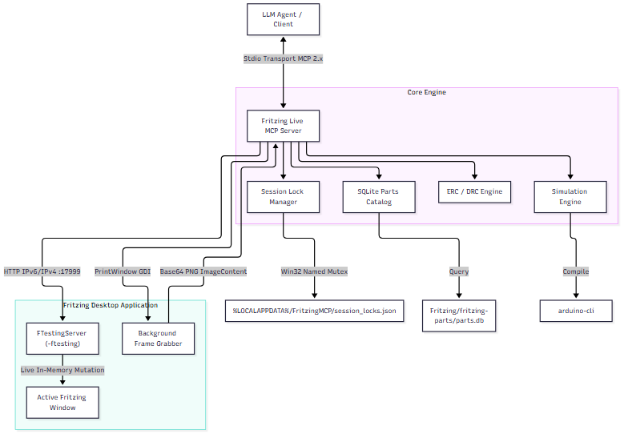

# Fritzing MCP Server (`fritzing-live-mcp`)

[](https.mit-license.org)
[](https://www.python.org/)
[](https://modelcontextprotocol.io)

An advanced Model Context Protocol (MCP) server for live, real-time control, visual verification, electrical rule checking, and firmware co-simulation of **Fritzing 1.0.8b** on Windows.

---

## 🌟 Key Features

* **⚡ Real-Time Live Window Mutations**: Modifies active breadboard, schematic, and PCB views in-place without closing, saving, or re-opening project files. The human user and AI agent work concurrently in the exact same workspace.
* **🔒 Multi-Session Exclusive Window Locking**: Guards against multi-agent collision. Uses Win32 Named Mutex (`Local\FritzingMcpSessionLockMutex`) and JSON lease registries to assign specific Fritzing windows to distinct LLM chat conversations.
* **👁️ Multimodal Visual Inspection**: Captures background GDI screenshots (`PrintWindow`) without taking mouse/keyboard focus or disturbing the user's desktop state. Returns inline Base64 PNG images directly inside MCP responses.
* **🔍 Fast SQLite Parts Search**: Queries Fritzing's native 16.7MB SQLite parts database (`parts.db`) for indexed component search (max 50 results), full metadata, and normalized pin connector tables.
* **⚡ Multi-Tier Electrical Rule Engine (ERC/DRC)**: Union-Find netlist engine detects VCC-GND power rail shorts, LEDs missing current-limiting resistors, floating pins, and unconnected components.
* **⚡ Analog & Firmware Simulation**: Integrated ngspice analog node voltage solver + `arduino-cli` firmware compilation with virtual UART serial monitor co-simulation.

---

## 🏗️ Architecture & Control Flow



---

## 📦 Installation & Setup

### Prerequisites
1. **Windows OS** (Win32 GDI & Named Mutex bindings).
2. **Fritzing 1.0.8b** installed (`C:\Users\<User>\AppData\Local\Programs\Fritzing\Fritzing.exe`).
3. **Python 3.10+**.
4. **Arduino CLI** (Optional, for MCU firmware compilation).

### Quick Install

```powershell
# Clone workspace
git clone https://github.com/razoring/FritzingMCP.git
cd FritzingMCP

# Create & activate virtual environment
python -m venv venv
.\venv\Scripts\Activate.ps1

# Install package dependencies
pip install -e .
```

---

## ⚙️ MCP Configuration

Add `fritzing-live-mcp` to your client configuration file (e.g. `%USERPROFILE%\.gemini\config\mcp_config.json`):

```json
{
  "mcpServers": {
    "fritzing-live-mcp": {
      "command": "C:\\Users\\<USER>\\OneDrive\\Documents\\Personal\\Projects\\Coding\\FritzingMCP\\venv\\Scripts\\python.exe",
      "args": [
        "-m",
        "fritzing_mcp.server"
      ],
      "disabled": false
    }
  }
}
```

---

## 🛠️ Tool Reference

### 1. Project & Lifecycle Management
| Tool Name | Description |
| :--- | :--- |
| `fritzing_status` | Environment + version + lock policy summary. |
| `fritzing_create_project` | Programmatically spawn a new `WTL-FZ-YYYY-NNNN` project window. |
| `fritzing_get_project` | Manifest view of placed components, nets, and properties. |
| `fritzing_save_project` | Lifecycle-gated save; forced path (never accepts arbitrary output path). |
| `fritzing_export` | Lifecycle-gated export (SVG, PDF, Gerber, BOM, Netlist). |

### 2. Multi-Session Window Concurrency
| Tool Name | Description |
| :--- | :--- |
| `fritzing_list_windows` | Enumerate all open Fritzing desktop windows & session lock statuses. |
| `fritzing_select_window` | Bind session to a target window & acquire 60s auto-renewing lease lock. |
| `fritzing_release_window` | Explicitly unlock bound window. |

### 3. Circuit & Parts Mutation
| Tool Name | Description |
| :--- | :--- |
| `fritzing_search_parts` | Indexed SQLite search across title, family, moduleID, or tags (max 50). |
| `fritzing_get_part` | Full metadata, trust, views, and connector list for a part. |
| `fritzing_get_part_connectors` | Normalized pin connector table. |
| `fritzing_place_part` | Add part instance to active canvas with position and rotation. |
| `fritzing_move_part` | Move existing placed component instance. |
| `fritzing_modify_part` | Update properties (e.g., resistance, capacitance, color). |
| `fritzing_remove_part` | Delete component instance from manifest. |
| `fritzing_wire` | Connect validated connector IDs between instances. |
| `fritzing_delete_wire` | Remove existing wire connection. |

### 4. Verification & Rendering
| Tool Name | Description |
| :--- | :--- |
| `fritzing_validate_project` | Multi-tier ERC/DRC execution (returns CRITICAL_ERROR, ERROR, WARNING). |
| `fritzing_switch_view` | Switch view tab (`breadboard`, `schematic`, or `pcb`). |
| `fritzing_render` | Gated native background rendering. |
| `fritzing_visual_report` | Inspect render artifacts list. |
| `fritzing_screenshot` | Capture background GDI frame and return Base64 PNG `ImageContent`. |

### 5. Electronics & Firmware Simulation
| Tool Name | Description |
| :--- | :--- |
| `fritzing_run_simulation` | Trigger ngspice analog circuit simulation. |
| `fritzing_compile_code` | Compile sketch using `arduino-cli`. |
| `fritzing_simulate_code` | Run MCU state machine simulation budget. |
| `fritzing_read_serial` | Read virtual UART serial monitor output. |
| `fritzing_write_serial` | Send UART serial input data to microcontroller. |

---

## 🧪 Testing

Run the comprehensive unit and integration test suite:

```powershell
.\venv\Scripts\python.exe -m pytest tests -v
```

---

## 📜 License

Distributed under the [MIT License](LICENSE).
